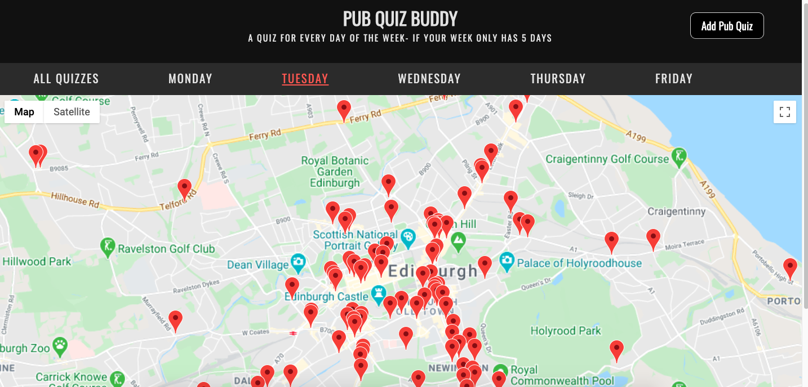
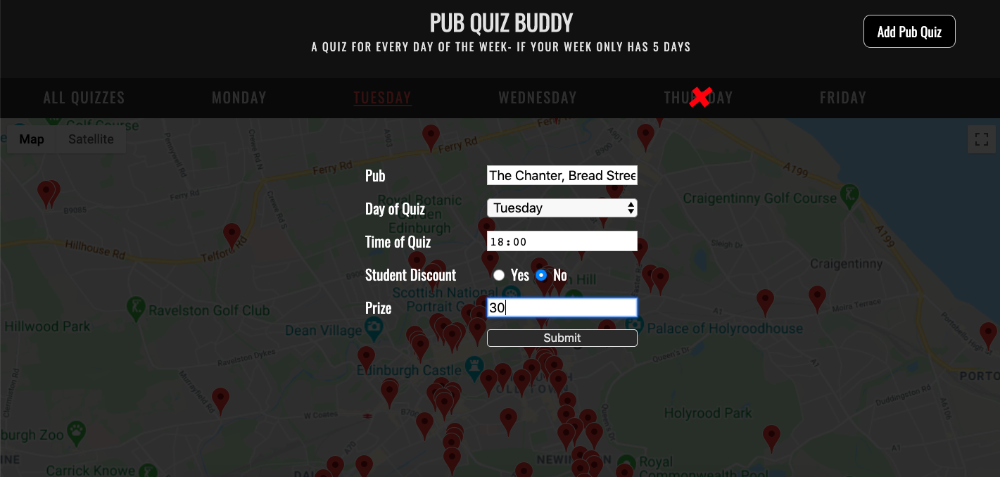

## Pub Quiz Buddy

This app was made by myself and 3 other students at CodeClan on Week 9 of the course.  It displays all the pub quizzes in Edinburgh filterable by day.  

The user is able to add a pub quiz if it not already be on the map, the form to do this is below. We use the Google Places API to get the lattitude / longtitude and address from its name (ie "The Black Bull").  This means that once submitted the pub will be added straight to the map.  In deploying this app we are disucussing some sort of process in which we can monitor what quizzes go up as a sort of quality control.

## The Brief

The people of Edinburgh are bored!  They want to find a pub quiz that they can do, but they have some requirements.  Some want to go on different days of the week, some one to bring the dogs.  This app will allow people to find the right quiz for their requirements.

### MVP

A pub quizzer should be able to:

- Filter quizzes by day and see those quizzes on a map.
- Click on a marker and open up more information about that quiz.
- Add their favourite Pub quiz if it is missing from the map.

### Extensions

- Filter quizzes by time, dog friendliness, student discount
- Filter by distance using their postcode

## How to setup Pub Quiz Buddy 

Pub Quiz buddy uses Google Apis so you will need to sign up to get a key. 

 - Create a Google developer account and sign up for an API key for both Google Maps and Google places.  For more info please visit https://developers.google.com/maps/documentation/javascript/get-api-key

- Git Clone this repo

- Create a file in your client directory called key.js

- In the file key.js please write this: key = "YOUR_API_KEY_HERE_PASTED_HERE"

- The hard part is now done!

- These following commands are all done using terminal.

- In both the server and client directory run 'npm install'

- In server directory run: 'npm run seeds'

- In server directory: 'npm run server:dev'

- Change to client directory: 'npm run serve'

- The App should now be loaded in localhost.  

